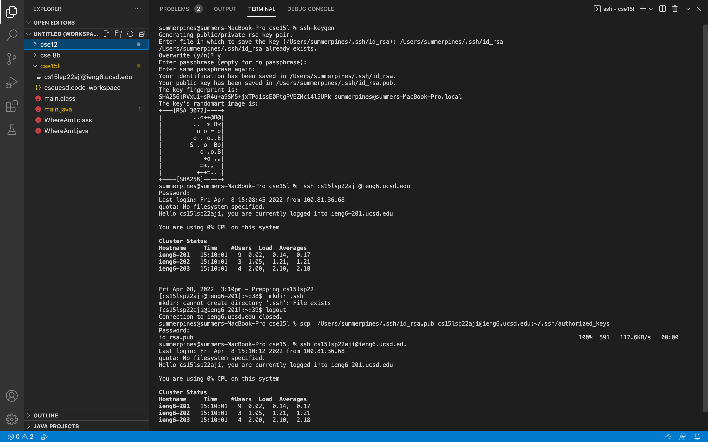

# **Week 2 Lab Report**

## **Hi CSE15L students, here is an instruction about how to log into a course-specific account on ieng6.**

## Let's get started!

### Step 1: Installing VScode
1. Go to [Visual Studio Code website](https://code.visualstudio.com/) to download the package based on your computer operating system (macOS, Windows x64, or Linux x64). 
2. After downloading, follow the installation instructions. When you installed and opened the VScode, it might look like this:
     
3. Once you have installed and set up the VScode, you can create a new file by clicking **"New File"**. 
     

### Step 2: Remotely Connecting
In CSE15L course, you will see how to connect your machine to a remote computer. 

1. Check your specific ETS account here: [https://sdacs.ucsd.edu/~icc/index.php](https://sdacs.ucsd.edu/~icc/index.php). 

    Once you enter your username and PID, click on sumbit, you should see the following page:
     
    *cs15l...* is your specific ETS account for this course, the last three letters are different among students.
    
    You could keep your password, or click on **"change your password"** on the webpage to set up a new one.
2. Then in VScode, open a new Terminal:
     
3. In the Terminal, type the following code (replace ... with your own ETS account):

    `ssh cs15l...@ieng6.ucsd.edu`

    It may pop up some questions like **"Are you sure you want to continue connecting (yes/no/[fingerprint])?**" for the first time. Type `yes` in the terminal to answer and press **Enter** tab.

    Then it will show **"Password: "**. Type your password which related with your ETS account in the terminal. It's ok if you can't see your password; your password is being inputed. 
    
    You should see something like this and your connection is successful:
    
     

    
### Step 3: Trying Some Commands
Try running the commands `cd, ls, pwd, mkdir,` and `cp` a few times in different ways, both on your computer, and on the remote computer after ssh-ing.

1. `cd`: change directory

    It will change the current directory to the directory you enter; default is ~ (home directory).
    

    

2. `ls`: list files

    It will list all the contents in the current directory.
    

    

3. `pwd`: print working directory

    It will print the current working directory in the terminal.
    

    
4. `mkdir`: make directory

    It will create a new directory, like `mkdir new directoryname`.

    

    
5. `cp` copy

    It will copy files to the directory, like `cd filename directoryname`.

    

    

6. You could try more code by yourself, like `rm`(remove), `mv`(move), or `touch`(create a file).
    

### Step 4: Moving Files with scp
There is a way to copy files from local systerm (your computer) to remote system, called `scp`(secure copy).

1. Create a new file called **WhereAmI.java**, and type the following contents. Try to run the same `javac` and `java` code in your terminal to see the results.
    
2. In the terminal, type the following code (replace ... with your own ETS account):

    `scp WhereAmI.java cs15l...@ieng6.ucsd.edu:~/`

    Then you enter the password the same one as you log in with ssh.
3. Log into your ieng6 with ssh again. Type `ls` to list files. You could see WhereAmI.java there. You could also run javac and java on file on the ieng6 computer.
    

### Step 5: Setting an SSH Key
It's time consuming to type your password every time when using ssh or scp. One way to save your time is **ssh keygen**. It creates a public and private keys which are stored on the server and client (lecture slide).

1. Type the following code in the terminal on your computer (**NOT THE SEVER**)

    * `/Users/<user-name>/.ssh/id_rsa` should be your own username, mine is summerpines.

    * When seeing **"Enter passphrass (empty for no passphrass):"** and **“Enter same passphrass (empty for no passphrass):”**, just press **Enter** tab (DO NOT TYPE ANYTHING).

    * `ssh cs15l...@ieng6.ucsd.edu` should be your own account. Also enter your own password.

    * Since I have done this before, it shows **"mkdir: cannot create directory '.ssh': File exists"**. The first time you type `mkdir .ssh`, it will create a new directory without showing this message.

        Later, when you want to re-try, you can remove using `rmdir .ssh/authorized_keys`, then re-copy your public key using `scp`.
    * When typing `scp /Users/<user-name>/.ssh/id_rsa.pub cs15l...@ieng6.ucsd.edu:~/.ssh/authorized_keys`, remember to replace username and account on your own. **"id_rsa.pub"** stands for public key and is copied to server's authorized_keys directory.

    
2. Open a new terminal, try `ssh cs15l...@ieng6.ucsd.edu`. This time, you should log in without entering the password.
    

### Step 6: Optimizing Remote Running
Give it a try. Make a local edit to WhereAmI.java, then copy it to the remote server and run it.

One way to do this is:

* You could use **up** arrow tab to quickly call the code you have typed before.
* `ssh cs15lsp22aji@ieng6.ucsd.edu "javac WhereAmI.java; java WhereAmI"` use semicolns to run multiple commands on the same line, and directly run the command on the remote server. Remember to replace the account with your own one.

## That's all for the instruction. You did a great job!

     
