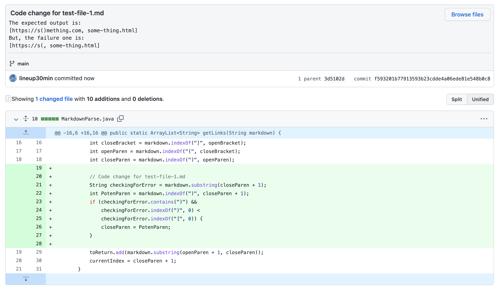
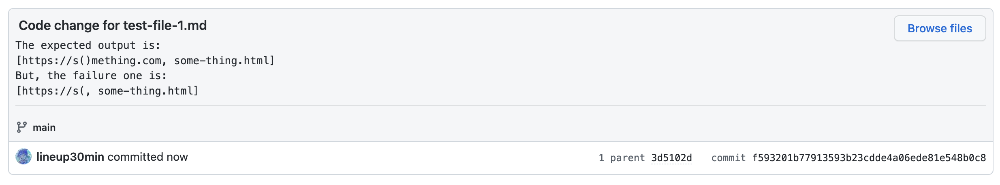
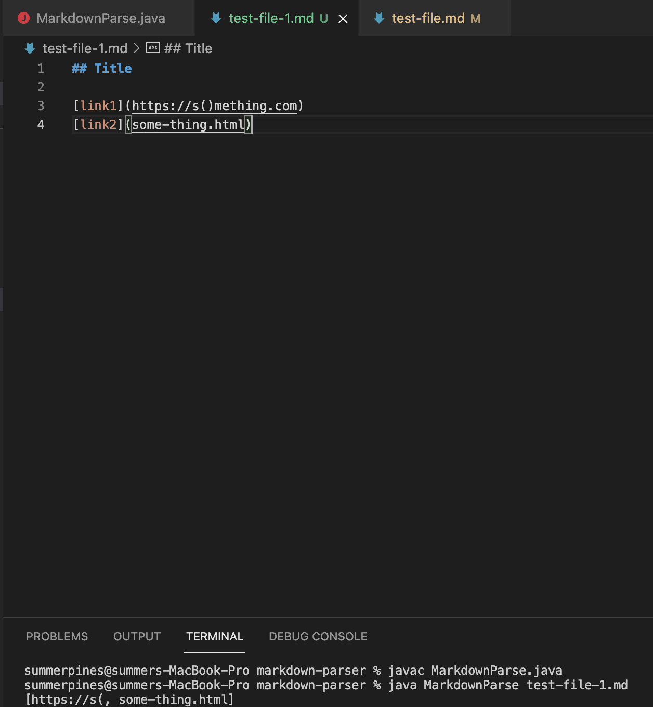
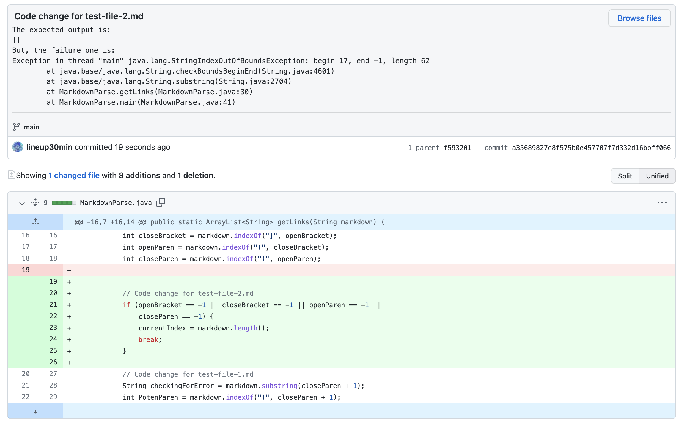
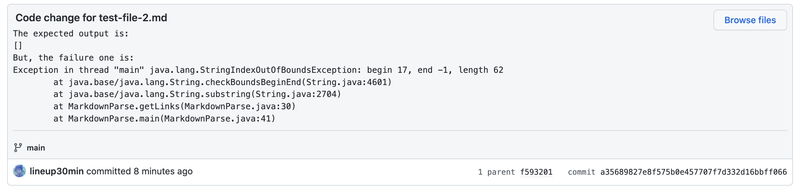
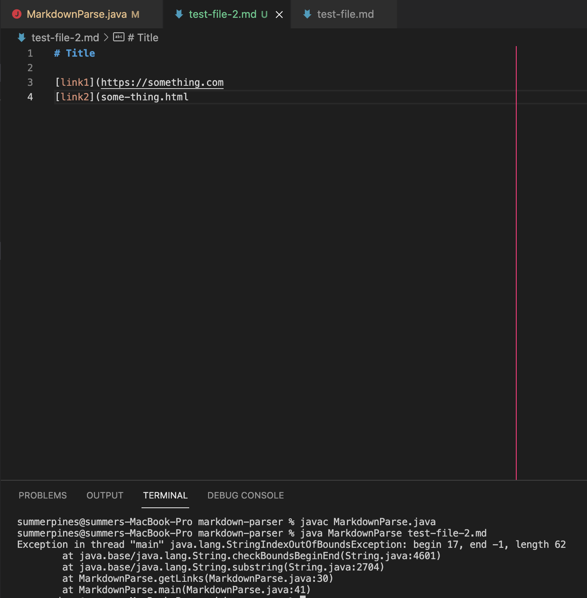
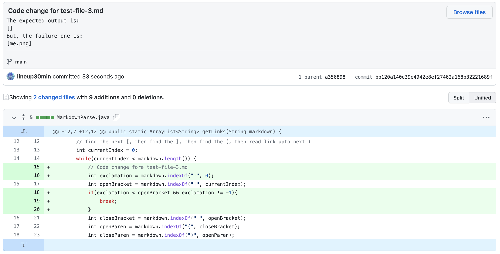
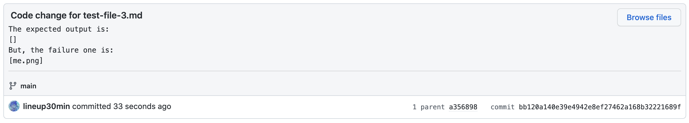
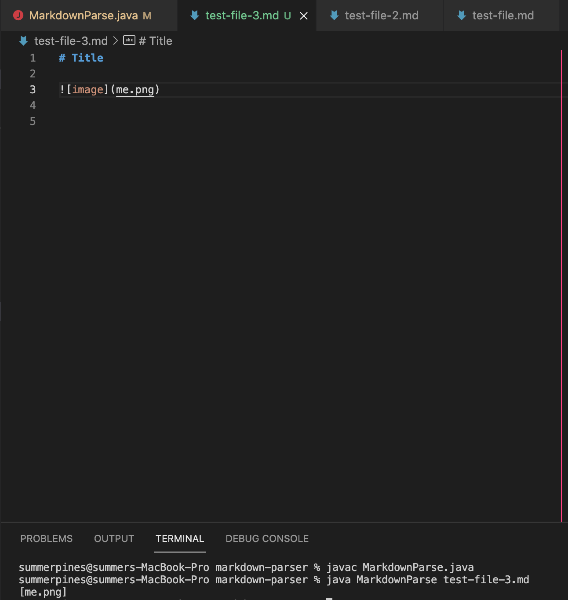

# **Week 4 Lab Report2**
## The first code change:
### 1. Code change different from Github for test-file-1.md:

### 2. [Link to the test-file-1.md](https://github.com/lineup30min/markdown-parser/blob/main/test-file-1.md) that prompted the change 
### 3. The output of running the file where it was failing:

### 4. Discription of the relationship between the bug, the symptom, and the failure-inducing input
The failure-inducing input, test-file-1, is a file with more parentheses inside the link. When running the commands in **MarkdownParse.java**, `int closeParen = markdown.indexOf(")", openParen);`looks for the first close parenthesis, and ignores the one appeared later. So, the symptom is the wrong answer with incomplete part of the link.

I add an if statement to check for error. If `String checkingForError` has close parenthesis, the index of `closeParen` is updated to be the index where last parenthesis exists in the same line.

---
## The second code change:
### 1. Code change different from Github for test-file-2.md:

### 2. [Link to the test-file-2.md](https://github.com/lineup30min/markdown-parser/blob/main/test-file-2.md) that prompted the change 
### 3. The output of running the file where it was failing:

### 4. Discription of the relationship between the bug, the symptom, and the failure-inducing input
The failure-inducing input, test-file-2, is a file missing close parenthesis. When running the commands, `int closeParen = markdown.indexOf(")", openParen);` couldn't find the close parenthsis at the given length thus causing a **StringIndexOutOfBoundsException** error. 

I add an if statement to check whether the test-file contains open bracket `(`, close bracket `)`, open parenthesis `[`, and close parenthesis `]`. If it doesn't, break the while loop, and print out empty arraylist.

---
## The third code change:
### 1. Code change different from Github for test-file-3.md:

### 2. [Link to the test-file-3.md](https://github.com/lineup30min/markdown-parser/blob/main/test-file-3.md) that prompted the change 
### 3. The output of running the file where it was failing:

### 4. Discription of the relationship between the bug, the symptom, and the failure-inducing input
The failure-inducing input, test-file-3, is a file with an image reference. It shouldn't print out the link. When running the commands in **MarkdownParse.java**, the exclamation sign doesn't have effects, so the wrong answer `[me.png]` is printed out. 

I add an if statement that if there exsits `exclamation` (exclamation sign) before `openBracket`. If it does, break the while loop, and print out empty arraylist.