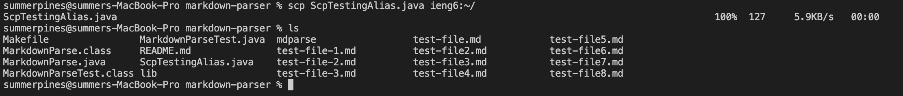
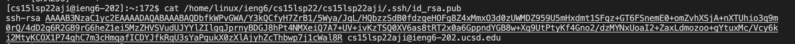
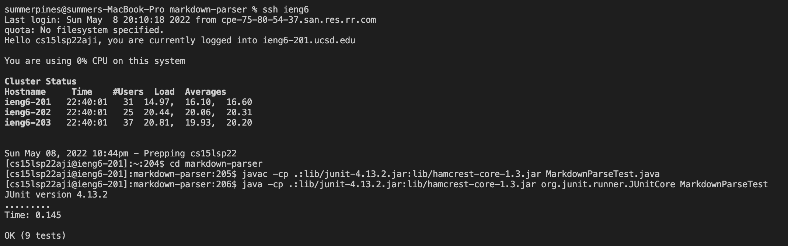
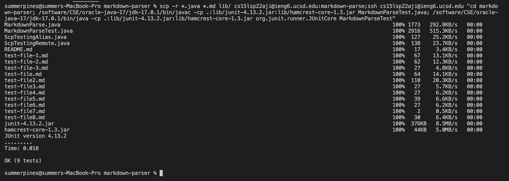

# **Week 6 Lab Report3**
## Streamlining ssh Configuration:
### 1. Show the .ssh/config file, edited with VScode:

### 2. Show the ssh command logging me into my account using the alias I chose:

### 3. Show an scp command copying a file to my account using just the alias I chose:

## Setup Github Access from ieng6
### 1. Show where the public key I made is stored on Github and in my user account (screenshot):
ieng620202 is the public key on ieng6

### 2. Show where the private key I made is stored on my user account (but not its contents) as a screenshot:

### 3. Show running git commands to commit and push a change to Github while logged into my ieng6 account:
Run ssh-keygen while logged into my course-specific account

Use `vi` to edit files on Linux 

Use `git add` and `git commit` to add and commit the changes

Use `git push` to push changes to GitHub

### 4. Show a link for the resulting commit:
[Link for the resulting commit](https://github.com/lineup30min/markdown-parser/commit/bbc02531a9d6933b4d7763421f55d54cc7ab66a9)
## Copy whole directories with scp -r
### 1. Show copying my whole markdown-parse directory to my ieng6 account:

*To have more control over what gets copied, use `scp -r *.java *.md lib/ cs15lsp22aji@ieng6.ucsd.edu:markdown-parse` to copy only md and java file*

### 2. Show logging into my ieng6 account after doing above and compiling and running the tests for my repository:

### 3. Show (like in the last step of the first lab) combining scp, ;, and ssh to copy the whole directory and run the tests in one line:
