# **Week 8 Lab Report4**
## A link to my markdown-parser repository and a link to the one I reviewed in week 7:
[My repository](https://github.com/lineup30min/markdown-parser)

[The reviewed repository](https://github.com/philliptwu/markdown-parser)

---
## Snippet 1:
### 1. Original markdown snippet:
```
`[a link`](url.com)

[another link](`google.com)`

[`cod[e`](google.com)

[`code]`](ucsd.edu)
```
### 2. Using the [CommonMark demo site](https://spec.commonmark.org/dingus/), it should produce:
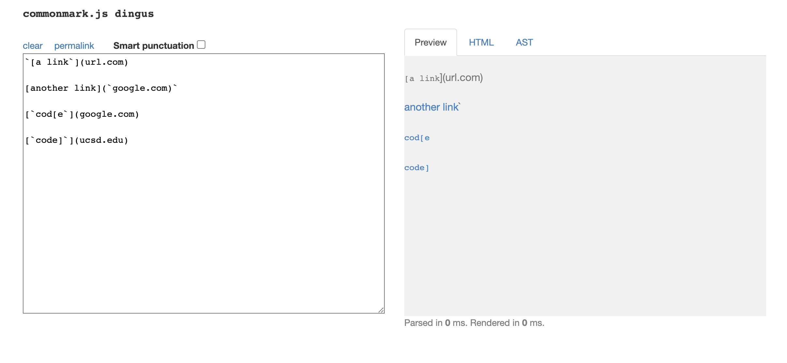

### 3. Showing how I turned the code into a test:
test file for snippet1:
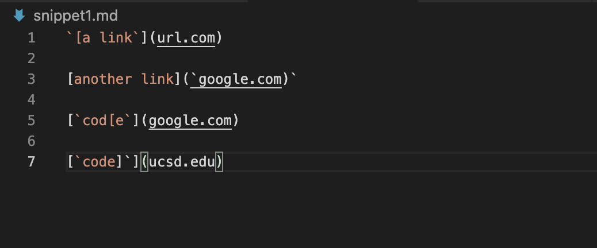
For my MarkdownParseTest.java:
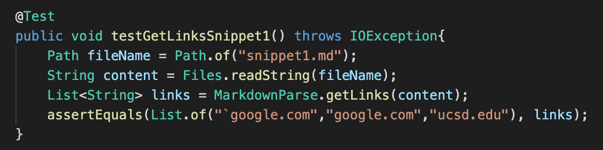
For MarkdownParseTest.java I reviewed in Week 7:
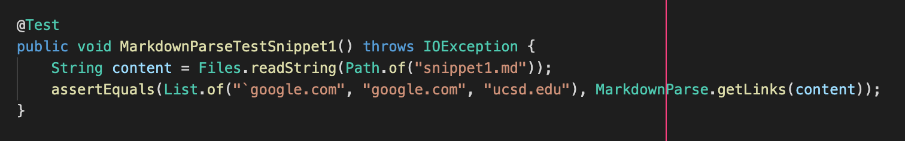

### 4. For my implementation, the specific part of the JUnit output that shows the test failure:
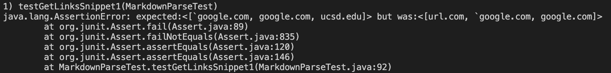

### 5. For the implementation I reviewed in Week 7, the specific part of the JUnit output that shows the test failure:
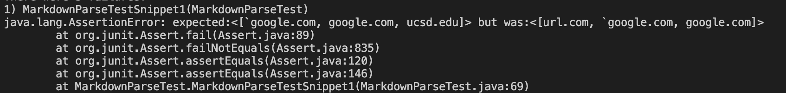

### 6. Is there a small (<10 lines) code change that will make my program work for snippet 1 and all related cases that use inline code with backticks?
I think it would be a more involved change. Since snippet 1 is not only about backticks, it has more than one openbracket or closebracket for the last two cases. It may be a small code change to check for the paired backticks by adding ```int backtick = markdown.indexOf("`", currentIndex);``` and if-statement, then if the paired backticks are both inside the paired brackets, cout it as a valid link. However, to check for the paired brackets, it needs to add more commands.

---
## Snippet 2:
### 1. Original markdown snippet:
```
[a [nested link](a.com)](b.com)

[a nested parenthesized url](a.com(()))

[some escaped \[ brackets \]](example.com)
```
### 2. Using the [CommonMark demo site](https://spec.commonmark.org/dingus/), it should produce:
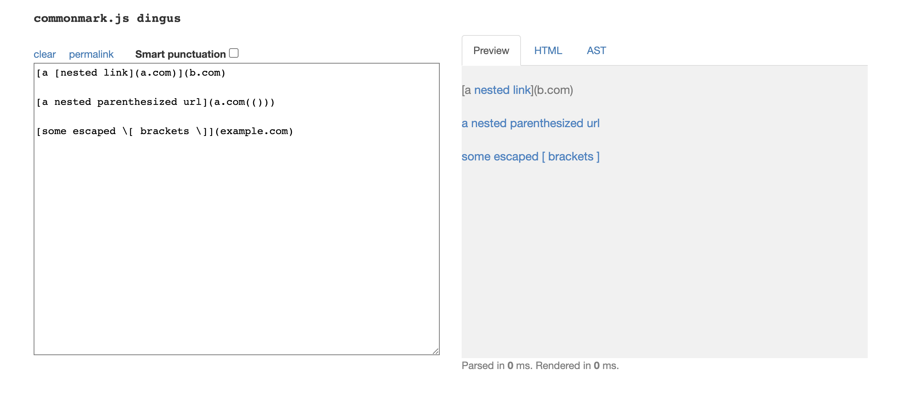

### 3. Showing how I turned the code into a test:
test file for snippet2:
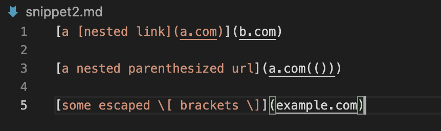
For my MarkdownParseTest.java:
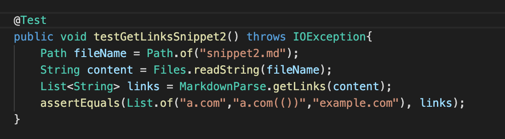
For MarkdownParseTest.java I reviewed in Week 7:
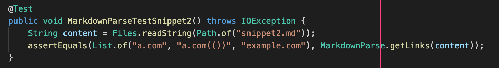

### 4. For my implementation, the specific part of the JUnit output that shows the test failure:
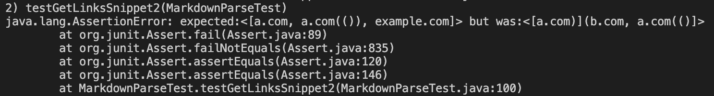

### 5. For the implementation I reviewed in Week 7, the specific part of the JUnit output that shows the test failure:
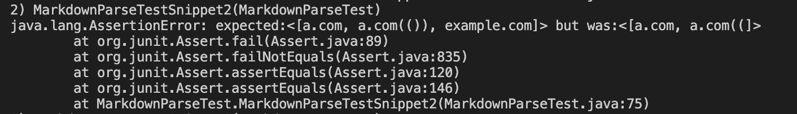

### 6. Is there a small (<10 lines) code change that will make my program work for snippet 2 and all related cases that nest parentheses, brackets, and escaped brackets?
I think it would be a more involved change. Since there are nested parentheses and brackets, I have to keep track of all the brackets until I find the last close bracket, and similar for the parentheses. I might create a stack--whenever I find a open bracket I push into it, and whenever I find a close bracket I pop from stack--printing everything between the first open parenthesis and last close parethesis as a valid link. I also need to define `int slash` to find `\[` and `\]` for escaped brackets.

---
## Snippet 3:
### 1. Original markdown snippet:
```
[this title text is really long and takes up more than 
one line

and has some line breaks](
    https://www.twitter.com
)

[this title text is really long and takes up more than 
one line](
https://sites.google.com/eng.ucsd.edu/cse-15l-spring-2022/schedule
)


[this link doesn't have a closing parenthesis](github.com

And there's still some more text after that.

[this link doesn't have a closing parenthesis for a while](https://cse.ucsd.edu/


)

And then there's more text
```
### 2. Using the [CommonMark demo site](https://spec.commonmark.org/dingus/), it should produce:
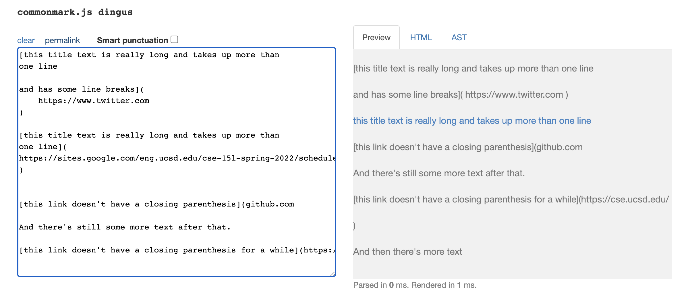

### 3. Showing how I turned the code into a test:
test file for snippet3:
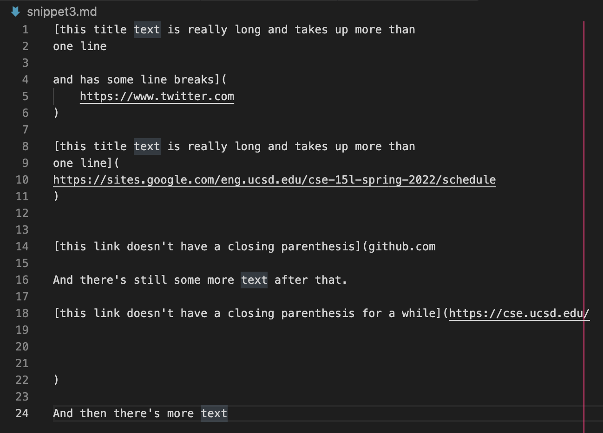
For my MarkdownParseTest.java:
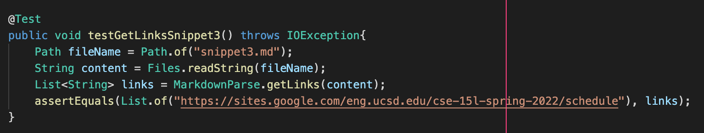
For MarkdownParseTest.java I reviewed in Week 7:
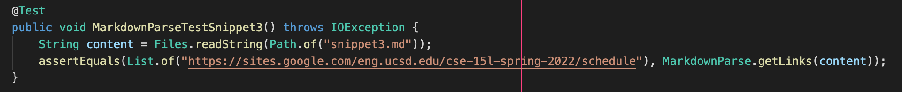

### 4. For my implementation, the specific part of the JUnit output that shows the test failure:
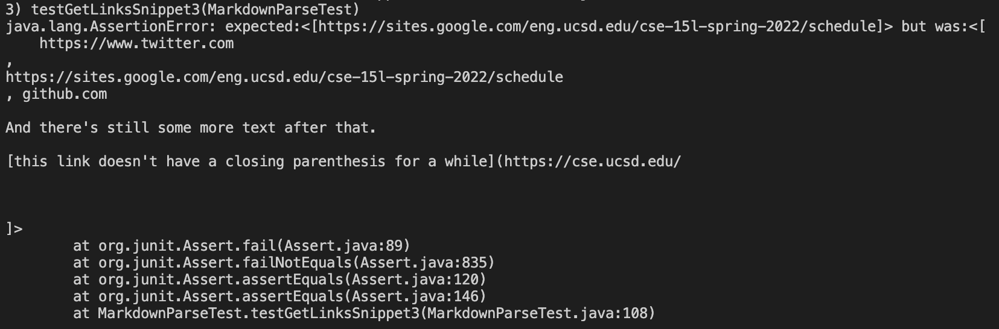

### 5. For the implementation I reviewed in Week 7, the specific part of the JUnit output that shows the test failure:
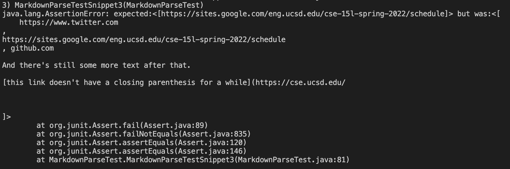

### 6. Is there a small (<10 lines) code change that will make my program work for snippet 3 and all related cases that have newlines in brackets and parentheses?
I think it would be a more involved change. Since in **CommonMark demo site** the code has some line breaks shouldn't be counted as a valid link, I might write if-statement that `if (space == closeParen - 1 || space == openParen + 1 )`, break the while loop and print nothing. I have to make sure that in the same line, there are paired parentheses. If the link doesn't have a closing parenthesis in a line, break the while loop instead of lookig for closing parenthesis in the newlines.

[Return to index](https://lineup30min.github.io/cse15l-lab-reports/)