# **Week 10 Lab Report5**
## I have found the tests with different results:
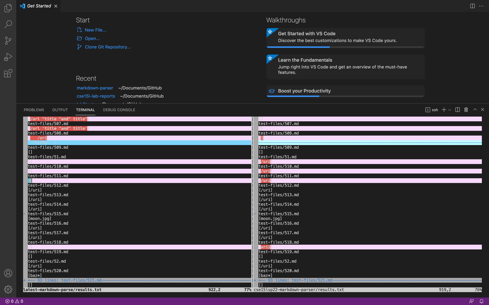
First I clone the repository as **cse15lsp22-markdown-parser** on my ieng6 account use `git clone`. I run `make test` and `bash script.sh > results.txt` to let output to go to a file in this repository.

Then I clone my latest markdown-parser in my home directory on ieng6, and name it **latest-markdown-parse**. Next I copy `script.sh` and `test-files/` into this repository. I run `make test`, and `bash script.sh > results.txt` in this repostiry.

Now I have two **results.txt** files. I use `vimdiff` on the results of running a bash:
```
vimdiff latest-markdown-parse/results.txt cse15lsp22-markdown-parser/results.txt
```
In this way, I found the tests with different results line by line.

---
## First different result:
### 1. Provide a link to the test-file 519.md: [519.md](https://github.com/nidhidhamnani/markdown-parser/blob/main/test-files/519.md)

519.md:

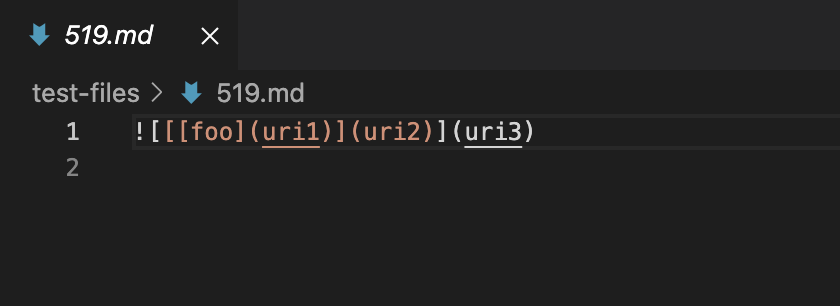

519.html.test:

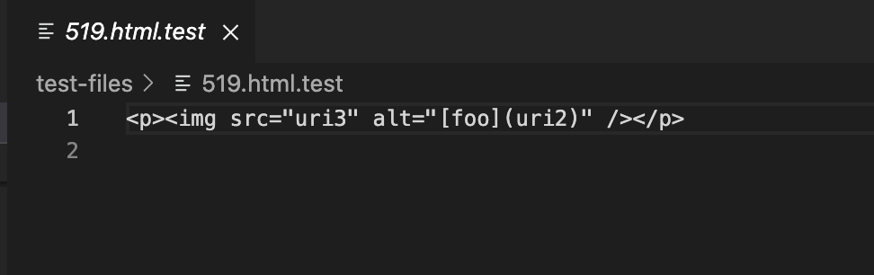

### 2. Expected output using the [CommonMark demo site](https://spec.commonmark.org/dingus/):

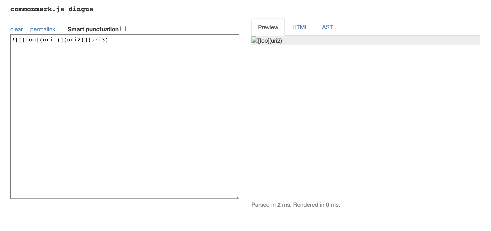

Since there is an exclamation mark before the first open bracket, it should be regarded as an image, not a link. The expected output would be [].

### 3. My actual output:

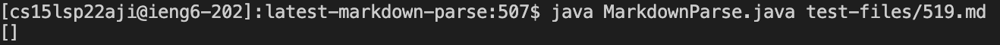

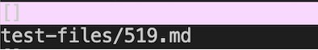

### 4. Lab9 actual output:

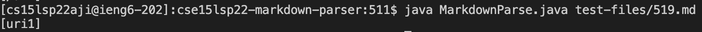

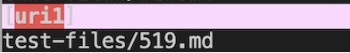

### 5. Describe the correctness of implementation and the bug, with code snippet that needs to be changed

My implementation is correct since it's not a valid link, while Lab9 is not correct. 

As code snippet shown below, the problem is that it didn't check whether there is an exclamation mark before `nextOpenBracket`. I would add an if-statement like ```if(exclamation < nextOpenBracket && exclamation != -1)``` below the last line to break out of the while loop when there exists an exclamation right before a open bracket.

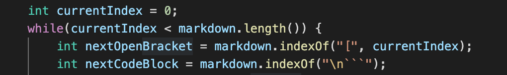

---
## Second different result:
### 1. Provide a link to the test-file 510.md: [510.md](https://github.com/nidhidhamnani/markdown-parser/blob/main/test-files/510.md)

510.md:

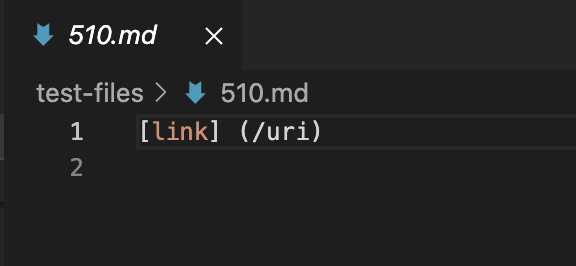

510.html.test:

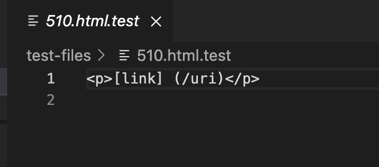

### 2. Expected output using the [CommonMark demo site](https://spec.commonmark.org/dingus/):

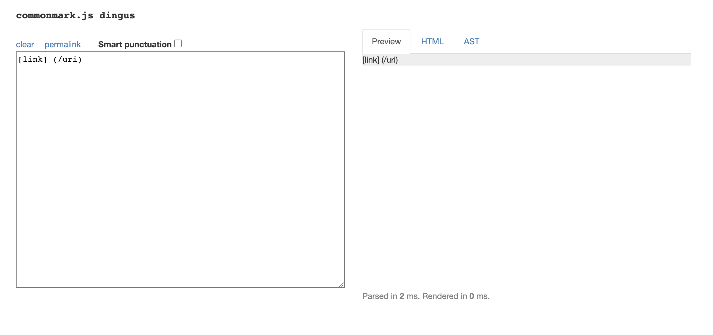

Since there is a space between close bracket and open parenthesis, it is not a valid link. The expected output would be [].

### 3. My actual output:

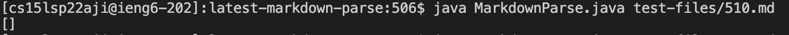

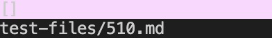

### 4. Lab9 actual output:

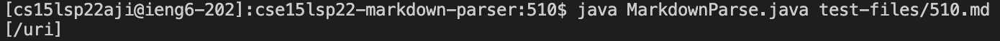

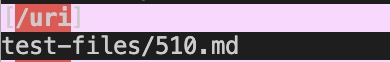

### 5. Describe the correctness of implementation and the bug, with code snippet that needs to be changed

My implementation is correct since it's not a valid link, while Lab9 is not correct. 

As code snippet shown below, the problem is that it didn't check whether there is an space between the last close bracket and first open parenthesis. It might need a helper method to find the last close bracket in nested brackets. I would also add an if-statement like ```if(nextCloseBracket + 1 != openParen)``` below the second line to break out of the while loop when there exists space between the close bracket and open parenthesis.  

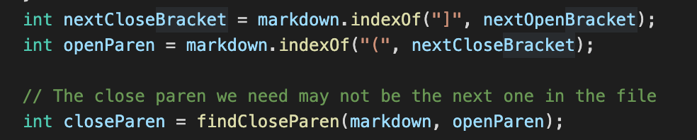

[Return to index](https://lineup30min.github.io/cse15l-lab-reports/)
