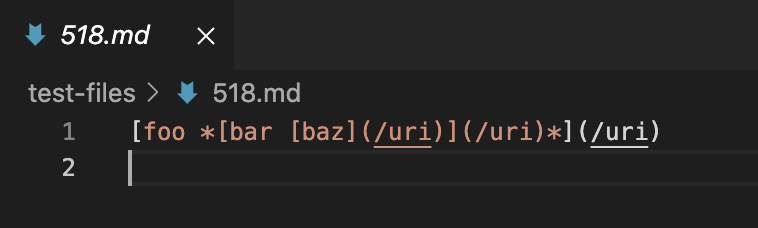
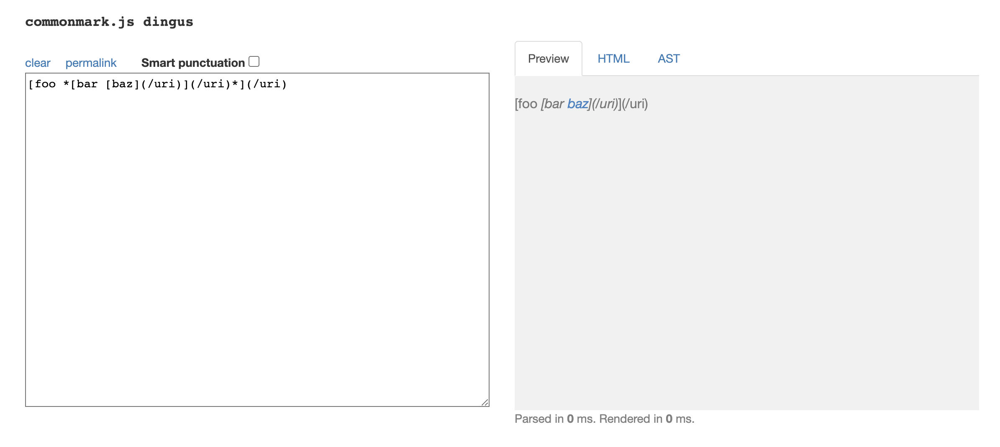
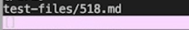
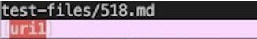
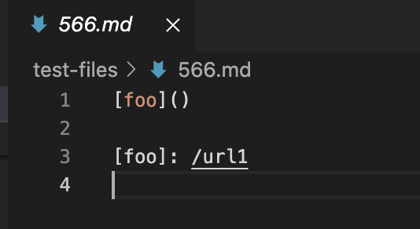
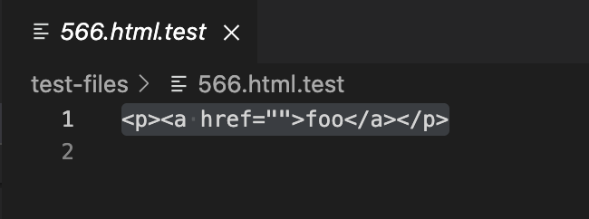
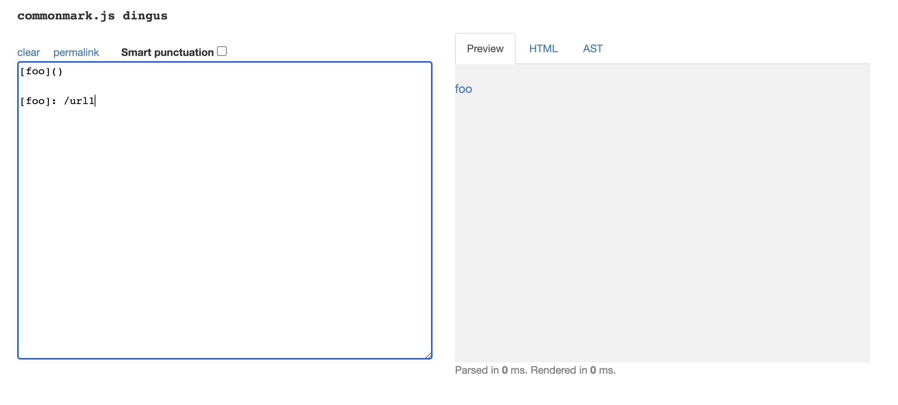
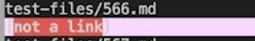

# **Week 10 Lab Report5**
## I have found the tests with different results:

First I clone the repository as **cse15lsp22-markdown-parser** on my ieng6 account use `git clone`. I run `make test` and `bash script.sh > results.txt` to let output to go to a file in this repository.

Then I clone my latest markdown-parser in my home directory on ieng6, and name it **latest-markdown-parse**. Next I copy `script.sh` and `test-files/` into this repository. I run `make test`, and `bash script.sh > results.txt` in this repostiry.

Now I have two **results.txt** files. I use `vimdiff` on the results of running a bash:
```
vimdiff latest-markdown-parse/results.txt cse15lsp22-markdown-parser/results.txt
```
In this way, I found the tests with different results line by line.

---
## First different result:
Provide a link to the test-file 518.md: [518.md](https://github.com/lineup30min/lab9/blob/main/518.md)

518.md:



518.html.test:


Expected output using the [CommonMark demo site](https://spec.commonmark.org/dingus/):



My actual output:



Lab9 actual output:



So it seems that both give the wrong output.

I choose my code to fix.

---
## Second different result:
Provide a link to the test-file 566.md: [566.md](https://github.com/lineup30min/lab9/blob/main/566.md)

566.md:



566.html.test:



Expected output using the [CommonMark demo site](https://spec.commonmark.org/dingus/):



My actual output:



Lab9 actual output:


So it seems that both give the wrong output.

I choose my code to fix.

[Return to index](https://lineup30min.github.io/cse15l-lab-reports/)
